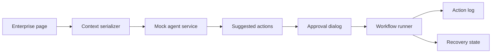

# AI UI Agent Demo

Angular demo of a UI-aware AI agent that reads page context, suggests workflow actions, requests approval, and shows execution state.

## Features

- Fake enterprise form/table page.
- AI agent panel.
- Context inspector.
- Suggested next actions.
- Approval flow.
- Action execution timeline.
- Recovery/error state.
- Mock browser/user action simulation.

## Architecture



## Recruiter Value

This repo shows how AI agents can operate with visible UI context and approval checkpoints instead of hidden automation.

## How To Run

```bash
npm install
npm start
```

No API key is required. All agent behavior is mocked.
