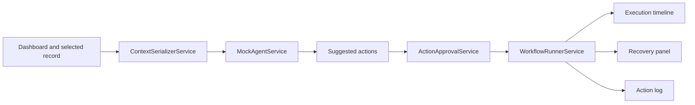

# AI UI Agent Demo

An Angular demo of a UI-aware AI agent that reads safe page context, suggests workflow actions, asks for approval, executes mocked actions, and surfaces recovery states in a visible operator UI.

All actions in this repo are mocked and safe. There is no real browser automation, no hidden backend execution, and no unsafe workflow mutation.


## Live Demo And Docs

Planned GitHub Pages target:
[https://ankitparekh007.github.io/ai-ui-agent-demo/](https://ankitparekh007.github.io/ai-ui-agent-demo/)

Until that is deployed, use the local demo and the docs in this repo.

## 20-Second GIF

Placeholder path for the launch clip:
`docs/assets/screenshots/ui-agent-flow.gif`

## What The Demo Shows

- fake enterprise dashboard with customer and product queue
- selected record detail panel with visible fields
- agent side panel with serialized safe context
- suggested actions based on the selected record
- approval-first workflow handling
- action execution timeline
- recovery and error panel
- action log for audit-friendly review

## Why UI Context Matters

An agent should not receive the entire hidden application state just because it can. This demo shows the opposite approach: serialize only safe, visible, relevant context such as route, role, selected record, status, owner, and visible fields. That makes the interaction easier to reason about, easier to debug, and safer to review with users.

## Demo Script

1. Open the fake customer operations dashboard.
2. Select a different record in the customer table and show how the context inspector changes.
3. Review the selected record detail panel and visible fields.
4. Click a suggested action that requires approval.
5. Approve the mocked workflow and show the execution timeline.
6. Trigger the mocked recovery action and show the recovery panel plus action log.

## Architecture



## Run Locally

```bash
npm install
npm start
```

Validation:

```bash
npm run build
npm test
```

## What This Proves For Recruiters

- Angular architecture for UI-aware agent experiences
- safe context serialization instead of vague “AI reads the page” claims
- approval-first workflow UX
- visible execution and recovery states
- honest mocking boundaries without fake automation claims

## Docs

- [Context serialization](docs/context-serialization.md)
- [Approval-first agent UX](docs/approval-first-agent-ux.md)
- [Action execution timeline](docs/action-execution-timeline.md)
- [Recovery states](docs/recovery-states.md)
- [Recruiter review guide](docs/recruiter-review-guide.md)
- [Screenshot and GIF capture guide](docs/screenshots.md)

## Contributing

See [CONTRIBUTING.md](CONTRIBUTING.md) and [GOOD_FIRST_ISSUES.md](GOOD_FIRST_ISSUES.md). The best contributions here are practical: one richer mock scenario, one accessibility improvement, one test case, or one clearer demo artifact.
