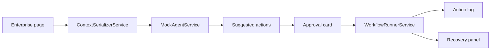

# AI UI Agent Demo

  

Angular demo of a UI-aware AI agent that reads page context, suggests workflow actions, requests approval, and shows execution state.


## What The Demo Shows

- Fake enterprise dashboard/page with table and form context.
- AI agent side panel.
- Context inspector for route, selected record, visible fields, and role.
- Suggested next actions.
- Approval dialog/card for workflow-changing action.
- Action execution timeline.
- Error/recovery state.
- Mock browser/user action simulation.

## Why UI Context Matters

A UI-aware agent needs to know what page the user is on, what record is selected, what fields are visible, and what role/permissions apply. This demo shows how that context can be serialized safely and rendered visibly before action.

## Architecture



## How To Run

```bash
npm install
npm start
```

Build check:

```bash
npm run build
```

No API key is required. All agent behavior is mocked.

## Demo Script

1. Open the dashboard and select the mock customer record.
2. Inspect the context panel: route, role, visible fields, and selected record.
3. Review suggested next actions from the mock agent.
4. Open the approval flow for the workflow-changing action.
5. Show the execution timeline and action log.
6. Point out the recovery panel and how failed actions would be handled.

## Recruiter Value

This repo proves UI-aware agent thinking: DOM/page-context serialization, approval UX, action execution visibility, recovery states, and enterprise AI interaction design.

## Interview Talking Points

- Why agents need safe page context instead of raw hidden DOM.
- How approval flows reduce risk for workflow automation.
- How action logs and recovery panels make automation auditable.
- How Angular services separate context, agent planning, approvals, and execution.
