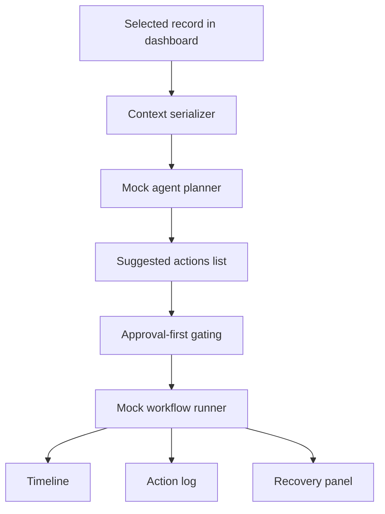

# Architecture

The demo is built around one idea: keep the agent’s understanding of the page explicit and safe.

## Flow

## Boundaries

- `ContextSerializerService`: turns selected UI state into safe context
- `MockAgentService`: generates mocked actions from that context
- `ActionApprovalService`: decides whether approval is required and shapes approval requests
- `WorkflowRunnerService`: emits mock timeline state and log entries

## Non-Goals

- real browser automation
- real backend side effects
- invisible action execution
